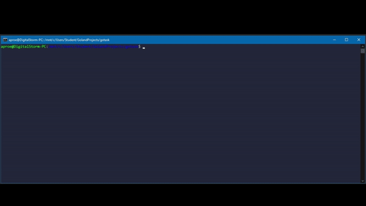
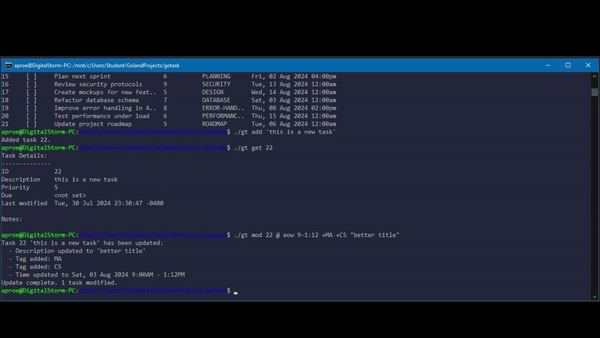

# GoTask - Efficient Task Management CLI




GoTask is a powerful command-line task management tool built in Go, designed to help you efficiently manage your tasks with features like priority settings, tagging, time tracking, and more.

## 🚀 Features

- **Task Management**: Create, update, and delete tasks
- **Time Tracking**: Set start and end times for tasks
- **Priority System**: Assign priorities to tasks
- **Tagging System**: Organize tasks with tags
- **Notes**: Add detailed notes to tasks
- **Filtering**: Filter tasks by various criteria
- **SQLite Storage**: Reliable local data storage

## 📁 Project Structure

```
gotask/
├── configs/            # Configuration files
│   └── config.yaml     # Main configuration
├── deployments/        # Deployment configurations
│   └── docker-compose.yml
├── internal/          # Private application code
│   ├── app/          # Main application logic
│   ├── cobra/        # CLI commands and handlers
│   ├── config/       # Configuration management
│   ├── service/      # Business logic services
│   ├── sqlite/       # Database layer
│   └── types/        # Common types and interfaces
├── pkg/              # Public packages
├── images/           # Project screenshots/demos
└── Makefile         # Build and development commands
```

## 🛠️ Installation

### Prerequisites
- Go 1.22.5 or higher
- SQLite3
- Make (optional, for using Makefile commands)

### Local Installation
```bash
# Clone the repository
git clone https://github.com/EvoSched/gotask.git
cd gotask

# Build the project
make build

# Or using Go directly
go build
```

### Docker Installation
```bash
# Build and run using Docker Compose
docker-compose up --build
```

## 🎯 Quick Start

1. Add a new task:
```bash
gotask add "Complete documentation" +docs @tomorrow !3
```

2. List all tasks:
```bash
gotask list
```

3. Mark task as done:
```bash
gotask done 1
```

4. Add a note to a task:
```bash
gotask note 1 "Added section about installation"
```

## 🔍 Command Reference

### Basic Commands
- `add`: Add a new task
- `list`: List all tasks
- `done`: Mark task(s) as completed
- `note`: Add a note to a task
- `delete`: Delete a task

### Task Properties
- `@`: Set time/date (e.g., @tomorrow, @2pm-4pm)
- `+`: Add tags (e.g., +urgent)
- `!`: Set priority (1-5, where 1 is highest)

### Time and Date Formats

GoTask supports various flexible time and date formats to make task scheduling intuitive:

#### Date Keywords
- `@today`, `@tod`: Current day
- `@tomorrow`, `@tmrw`: Next day
- `@monday` (or any weekday): Next occurrence of that weekday
- `@eod`: End of current day (11:59 PM)
- `@now`: Current time

#### Time Formats
- 12-hour format: `@2pm`, `@2:30pm`, `@2:30PM`
- 24-hour format: `@14:00`, `@1400`
- Time ranges: `@2pm-4pm`, `@14:00-16:00`
- Combined date and time: `@tomorrow 2pm`, `@monday 14:00`

#### Custom Date Formats
- Standard date: `@2024-03-15`, `@15/03/2024`
- Relative days: `@+3` (3 days from now)

All time inputs are converted to 24-hour format internally for consistency.

## 🔧 Configuration

Copy `.env.example` to `.env` and adjust the settings:
```bash
cp .env.example .env
```

Key configurations:
- `APP_PORT`: Application port (default: 8080)
- Other configurations can be set in `configs/config.yaml`

## 🚀 Development

### Requirements
- Go 1.22.5
- Air (for hot reload)
- Docker & Docker Compose (for containerized development)

### Development Commands
```bash
# Run with hot reload
make dev

# Run tests
make test

# Build Docker image
make docker-build
```

## 📝 Contributing

1. Fork the repository
2. Create your feature branch (`git checkout -b feature/amazing-feature`)
3. Commit your changes (`git commit -m 'Add amazing feature'`)
4. Push to the branch (`git push origin feature/amazing-feature`)
5. Open a Pull Request

## 📄 License

This project is licensed under the MIT License - see the [LICENSE](LICENSE) file for details.

## 🙏 Acknowledgments

- [Cobra](https://github.com/spf13/cobra) for CLI framework
- [Viper](https://github.com/spf13/viper) for configuration management
- [SQLite](https://www.sqlite.org/) for database management

---
Made with ❤️ by EvoSched